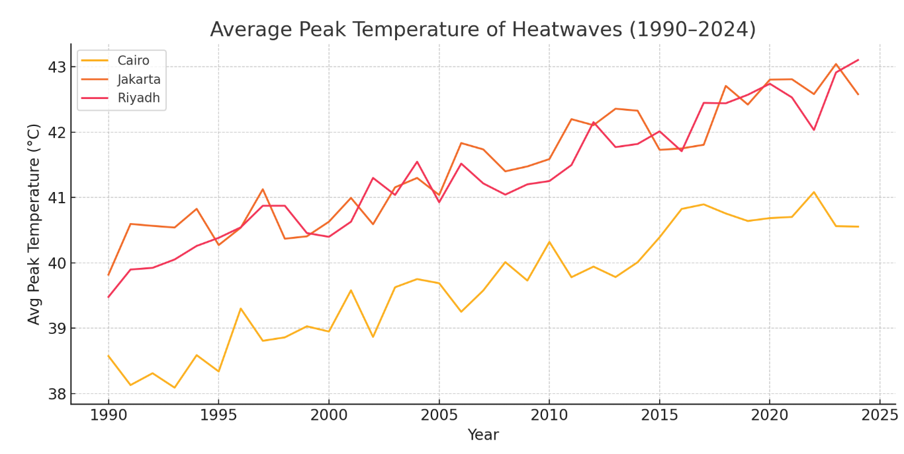
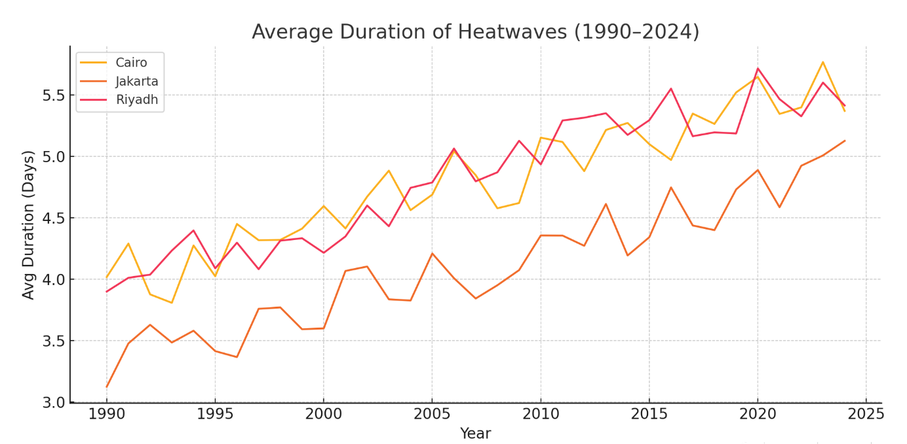
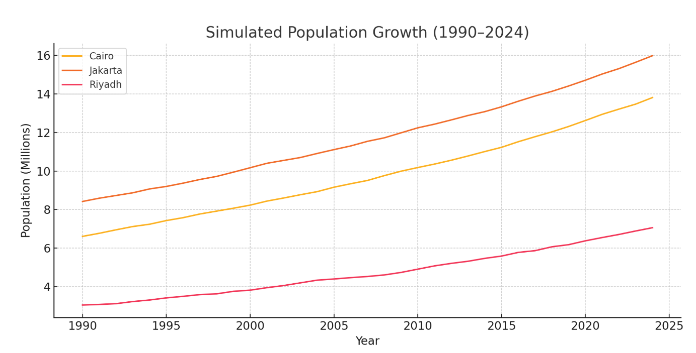

# Domain Research

## 🌍 Domain Overview: Climate Change & Urban Heatwaves

This folder contains our team’s research notes, resources, and summaries related
to our domain: climate change and its impacts on urban systems. Our focus is on
understanding how rising temperatures—especially in the form of extreme heat
events—are affecting rapidly growing cities, and what this means for public
health, infrastructure, and vulnerable communities.

---

## 🧭 Background & Relevance

Climate change is no longer a distant threat — it is a current reality reshaping
life in cities around the world. One of the most severe and immediate
manifestations is the rise in extreme heat events, particularly in urban
environments. These environments are especially vulnerable due to the
**urban heat island (UHI) effect**, where buildings, roads, and dense
development trap heat and raise local temperatures.

As cities expand, they often outpace the infrastructure needed to protect their
populations. Heatwaves in these areas can strain power grids, overload health
services, and threaten the lives of people living in poorly ventilated housing
or without access to cooling. Vulnerable populations — including
residents, outdoor workers, and low-income families — are disproportionately affected.

Understanding how heatwaves have changed in duration and intensity over time
can help cities prepare and adapt through early warning systems, green
infrastructure, and targeted energy policies.

---

## ❓ Research Question & Scope

**Main Research Question:**  
*“How have the duration and peak intensity of summertime heat waves (X) changed
over the 1990–2024 period (Y) in rapidly urbanizing metropolitan areas (Z),
and what does that imply for public-health officials, energy utilities,
and heat-vulnerable residents?”*

### 🔍 Breaking it Down

- **X – What:** Duration (number of days) and peak intensity
(maximum temperature) of heat waves  
- **Y – When:** 1990 to 2024  
- **Z – Where:** Rapidly urbanizing cities in regions like North Africa,
Southeast Asia, or the Middle East

We aim to explore how these patterns have shifted over time and how these shifts
create new challenges for:

- Public-health officials designing emergency response systems
- Energy providers managing electricity demand (especially for cooling)
- Urban planners focused on protecting at-risk populations

---

## Key Points

- **Stakeholders:** Public-health officials, energy utilities, urban planners,  
  and vulnerable residents.

- **Systems Thinking:** Rising urban temperatures drive higher cooling demand,  
  increasing energy use and potentially worsening warming if energy is not  
  sustainable.
b
- **Data:** Analysis uses NASA MODIS and NOAA GHCN datasets, guided by IPCC and
  peer-reviewed literature.
  
  ---

## 📊 Data & Literature Foundations

We will be reviewing:

- Temperature datasets including:
  - **NASA MODIS** Land Surface Temperature
  - **NOAA GHCN** (Global Historical Climatology Network)
- IPCC Sixth Assessment Report (especially chapters on urban adaptation)
- Academic papers on:
  - Urban Heat Island effects
  - Climate change and urbanization
  - Heatwave definitions and thresholds

We will also review definitions of heatwaves from different climate
organizations to determine appropriate thresholds (e.g., 90th percentile
temperature for 3+ consecutive days).

---

## ✅ Next Steps

- Finalize metropolitan areas as our study focus  
- Define a consistent method for identifying and measuring heatwaves  
- Continue summarizing relevant papers and datasets  
- Prepare for data collecting in the next milestone

---

For more details and supporting resources, see the [full problem domain
summary](https://github.com/MIT-Emerging-Talent/ET6-CDSP-group-02-repo/blob/main/0_domain_study/problem_domain_summary.md).

## 📊 Milestone 2: Data Collection — Domain Modeling

## 🧭 How We Modeled Our Domain

To investigate how extreme heat events are evolving in fast-growing cities,  
we first needed a clear, measurable way to represent "heat waves" and  
"urbanization" in data.

### 🔥 Modeling Heat Waves

We defined a heat wave using a common scientific metric called **CTX90**,  
where daily high temperatures exceed the 90th percentile of historical  
values for at least **three consecutive days**. This allowed us to extract  
three core measurements per event:

- **Duration**: Total days the heatwave lasted  
- **Peak intensity**: Highest temperature recorded during the event  
- **Cumulative heat**: The total excess temperature across all days  

By measuring these, we can track how extreme heat events have changed from  
1990 to 2024 in both **intensity** and **length**.

### 🏙️ Modeling Rapid Urbanization

We defined “rapidly urbanizing metropolitan areas” by combining two  
metrics:

- **Population growth rate** (1990–2024)  
- **Urban land expansion** (change in built-up area)  

Using this, we selected cities from North Africa, Southeast Asia, and the  
Middle East that have seen dramatic urban growth and are vulnerable to  
heat-related stress.

### 🗺️ Why This Matters

This modeling helps us explore how rising temperatures and growing cities  
combine to challenge:

- **Public health systems** (e.g., heat-related illness)  
- **Electricity utilities** (e.g., increased cooling demand)  
- **Urban planners** (e.g., protecting vulnerable populations)  

### ⚠️ Modeling Limitations

Despite our efforts, our model has a few key limitations:

- **Temperature data is gridded**, not measured directly at each city’s  
  weather station. This may smooth out extremes.  
- **Urbanization metrics are global estimates**, which may miss nuances  
  like informal settlements or local construction.  
- **Health and energy data** were only partially available, so we relied  
  on regional proxies and literature instead of city-level records.  

---

## 📈 Visualizations

**Average Peak Temperature of Heatwaves (1990–2024)**  

**Average Duration of Heatwaves (1990–2024)**  

**Population Growth of Selected Cities (1990–2024)**  

---

📘 [View Full Data Dictionary](./data_dictionary.md)
